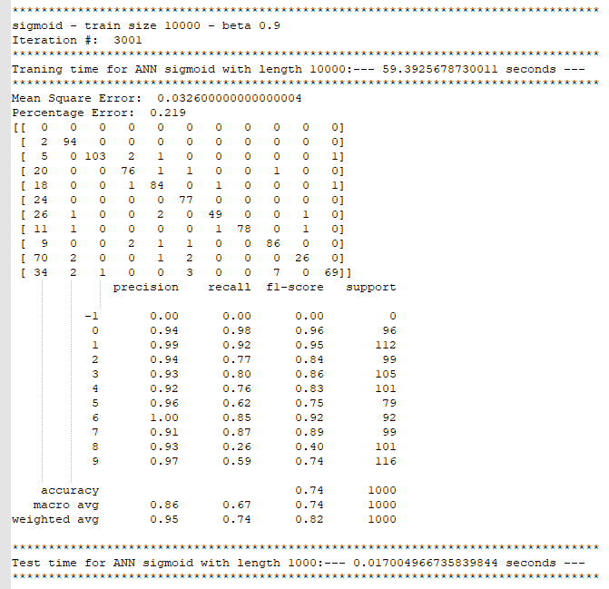

# Handwritten-digits-recognition-by-ANN-SLP
This project aims to use an artificial neural network (ANN) to train a simple
system (*single-layer perceptron (SLP)*) for the recognition of handwritten digits (0,
1, …, 9).

We design a fully connected network structure of 784 input nodes and ten output
nodes.  
The input to the single-layer network architecture will be a set of binary
pixels representing a  
28×28 image of handwritten digits. The output should indicate which digits
(0,....,9) are in the input image.

This project uses the MNIST database of handwritten digits for testing and
training the system attached here as "mnist_handwritten.csv." It contains 60k
images that are sorted as one vector, each with its labels.

To begin with, we select a subset of the MNIST database consisting of around 500
images of handwritten digits (0,...,9) for training the system and use another
100 images for testing the system. Next, we create binary or bipolar images of
handwritten digits from grayscale images available in MNIST by simple
thresholding.

To have an overview of our data, first, I plotted the distribution of labels
(digits). As you can see in the figure below, overall, it is okay.

I used the threshold value 150 to convert the gray images to binary images.
After selecting 500 images as the training set and 100 images as the testing
set, by considering beta 0.01, epsilon 0.001, and maximum iteration 3000, I
followed the steps below to learn the network:

1.  Initializing the weights by np.ones((10,784)) \* 0.01 (we have 784 input and
    10 output for each training row)

2.  Computing v by dot product of w and x np.dot(w,np.transpose(x)) + w0

3.  Applying the activation function and computing y
    activation_function(v,kernel\_type)

4.  Calculating the erroe e e = np.transpose(d)-y

5.  Computing ∆w dw = np.dot(beta\*e,x)

6.  Modifing w w = w + dw

7.  Repeating step 2 to 6 until e\<0.01 or iteration\>3000

Then I used the calculated w and the test set to test the model. As the figure
below shows, the accuracy is 65%, the mean square error (MSE), and the
percentage error (PE) are 0.054 and 0.36, respectively.

A confusion matrix and classification report are provided for all the scenarios
to understand the results better.

Then we plot a learning curve that illustrates the mean square error versus
iterations.

|  |
|------------------------------------------------------------------------------------------|

The result shows that the mean square error (MSE) decreases significantly at the
first iteration. It decreases more by having more iterations.  
We can also plot the percentage error in testing the handwritten digit
recognition system as a bar chart. It shows the mean error that occurred while
testing each digit with the test data.

|  |  |
|-----------------------------------------------------------------------------------------------------|-----------------------------------------------------------------------------------------------------|

We see a significant error at digits 5 and 8. If we depict the distribution of
digits in the training data, we can find biased data on 5 and 8 (see the figure
below). So, it makes sense to have more errors on 5 and 8.

Then we repeat this experiment for different learning rate parameters. We start
with a large value and gradually decrease to a small value. I considered 5
values {0.01, 0.2, 0.5, 0.7, 0.9} for the learning rate. There is no significant
change in the results, but by decreasing beta, the MSE and PE decrease, and the
training time increases (see the results below). Indeed, the learning rate can
control the model's speed. Lower learning rates need more training epochs. Too
large learning rates lead the model to converge too quickly to a non-optimal
weight. Also, the too-small ones lead to a very slow model.

Training size 500 – Beta 0.9

Training size 500 – Beta 0.7

Training size 500 – Beta 0.5

Training size 500 – Beta 0.2

Training size 500 – Beta 0.1

| Threshold – Training size 500 – Various learning rate      |                                                                |
|------------------------------------------------------------|----------------------------------------------------------------|
|             |                 |
| Iteration \#: 67 Traning time: 0.18236017227172852 seconds | Mean Square Error: 0.057 Percentage Error: 0.37                |
|             |                 |
| Iteration \#: 67 Traning time: 0.20390677452087402 seconds | Mean Square Error: 0.057 Percentage Error: 0.37                |
|             |                 |
| Iteration \#: 67 Traning time: 0.18638300895690918 seconds | Mean Square Error: 0.057 Percentage Error: 0.37                |
|             |                 |
| Iteration \#: 66 Traning time: 0.16989684104919434 seconds | Mean Square Error: 0.05600000000000001 Percentage Error: 0.36  |
|             |                 |
| Iteration \#: 67 Traning time: 0.17978572845458984 seconds | Mean Square Error: 0.054000000000000006 Percentage Error: 0.36 |

|  |  |
|-------------------------------------------------|-------------------------------------------------|
|  |  |
|  |                                                 |

Also, there is no significant change in the iteration number.

Let's repeat the experiment with a more extensive database; the first 10000
images for training (image indexes from 0-10000) and test with another 1000
images (image indexes from 20000-21000).

By increasing the training size, the accuracy and the training time increase.
Changing the beta, we can have minor improvement on the accuracy. The training
time is around 135 seconds, and the accuracy is at most 73%. Compared with the
previous training set, this training set needs much more iterations to reach an
error less than epsilon.

Training size 10000 – Beta 0.9

**

Training size 10000 – Beta 0.7

**

*  
*Training size 10000 – Beta 0.5

**

Training size 10000 – Beta 0.2

**

*  
*

Training size 10000 – Beta 0.1

**

Comparing to the SVM, ANN is less accurate on the selected training set. Also,
the processing time of ANN is much more than SVM, 134 versus 5 seconds.

| Threshold – Training size 10000 – Various learning rate     |                                                                |
|-------------------------------------------------------------|----------------------------------------------------------------|
|              |                 |
| Iteration \#: 3001 Traning time: 137.32243943214417 seconds | Mean Square Error: 0.0446 Percentage Error: 0.28               |
|              |                 |
| Iteration \#: 3001 Traning time: 134.11536717414856 seconds | Mean Square Error: 0.0493 Percentage Error: 0.287              |
|              |                 |
| Iteration \#: 3001 Traning time: 133.62726068496704 seconds | Mean Square Error: 0.0528 Percentage Error: 0.316              |
|              |                 |
| Iteration \#: 3001 Traning time: 134.44923448562622 seconds | Mean Square Error: 0.05090000000000001 Percentage Error: 0.309 |
|              |                 |
| Iteration \#: 3001 Traning time: 134.25897192955017 seconds | Mean Square Error: 0.045 Percentage Error: 0.28                |

|  |  |
|-------------------------------------------------|-------------------------------------------------|
|  |  |
|  |                                                 |

*  
*

What will happen if we repeat the experiment with multilevel data while
normalizing the input data and using the sigmoid function for output
thresholding (without thresholding the input data)?

This model is more accurate, but the training time is half of the previous
experience. In addition, sigmoid increases convergence speed, so the network can
more quickly reach smaller errors.

Sigmoid – Beta 0.9

Sigmoid – Beta 0.7

Sigmoid – Beta 0.5

Sigmoid – Beta 0.2

Sigmoid – Beta 0.1

|  Sigmoid – training size 10000 – Learning rate 0.9          |                                                                 |
|-------------------------------------------------------------|-----------------------------------------------------------------|
|              |                  |
| Iteration \#: 3001 Traning time: 40.01509189605713 seconds  | Mean Square Error: 0.032600000000000004 Percentage Error: 0.219 |
| Sigmoid – training size 10000 – Learning rate 0.7           |                                                                 |
|              |                  |
| Iteration \#: 3001 Traning time: 41.2118194103241 seconds   | Mean Square Error: 0.0417 Percentage Error: 0.252               |
| Sigmoid – training size 10000 – Learning rate 0.5           |                                                                 |
|              |                  |
| Iteration \#: 3001 Traning time: 42.169373512268066 seconds | Mean Square Error: 0.04 Percentage Error: 0.253                 |
| Sigmoid – training size 10000 – Learning rate 0.2           |                                                                 |
|              |                  |
| Iteration \#: 3001 Traning time: 42.01747918128967 seconds  | Mean Square Error: 0.0378 Percentage Error: 0.234               |
| Sigmoid – training size 10000 – Learning rate 0.1           |                                                                 |
|              |                  |
| Iteration \#: 3001 Traning time: 42.08747053146362 seconds  | Mean Square Error: 0.0407 Percentage Error: 0.26                |

|  |  |
|-------------------------------------------------|-------------------------------------------------|
|  |  |
|  |                                                 |

Considering the same training and testing dataset, SVM has a better performance
in comparison with ANN. I think the main reason is that we used a single-layer
ANN network, so it can be improved by adding some hidden layers. On the other
hand, decreasing the epsilon and increasing the iteration number can lead to a
more accurate model. Here, the SVM model is much faster and more accurate than
ANN.

SVM – Training size 10000

****

ANN – Training size 10000

****

To visualize the model's result, I randomly select six images and their
predicted labels. As you can see in the figure below, the model's performance is
as we expected.

|                                       |  |  |
|--------------------------------------------------------------------------------------|-------------------------------------------------|-------------------------------------------------|
|                                       |  |  |
| *Comparing the predicted label by ANN (sigmoid – multilevel) with the actual label*  |                                                 |                                                 |

In conclusion, the size of the training set has a significant effect on the
model's performance. The learning rate can control convergence speed, and the
sigmoid has a better performance than the simple threshold activation function.
Overall, single layer ANN has a weaker performance as compared to the SVM.

**References:**

<https://www.kaggle.com/mirichoi0218/ann-slp-making-model-for-multi-classification>

<https://www.kaggle.com/shivamb/a-very-comprehensive-tutorial-nn-cnn>
